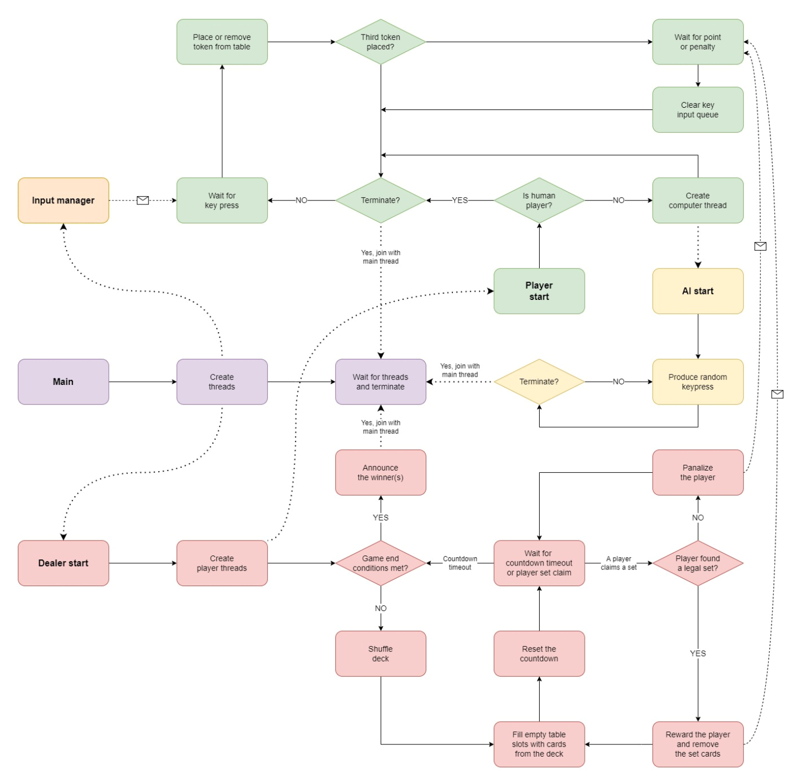
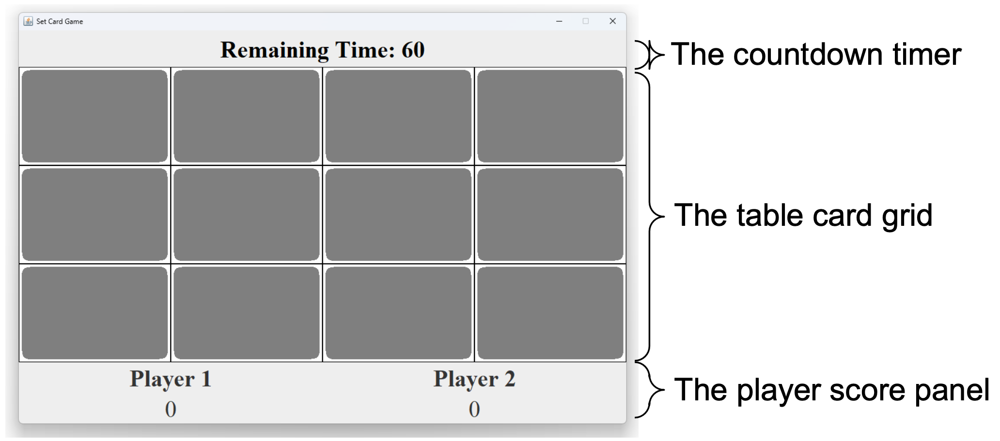
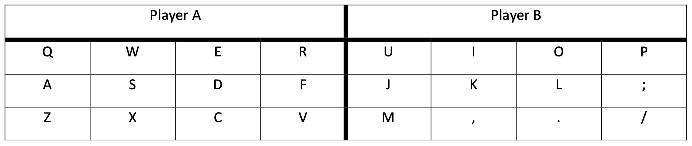

## Set Card Game — Concurrent Java Simulation

### Objective
Showcase practical Java concurrency, synchronization, and test‑driven development by implementing a playable Set card game with a responsive Swing UI.

## Table of Contents
- [Overview](#overview)
- [Key Features](#key-features)
- [Architecture](#architecture)
- [Concurrency and Synchronization](#concurrency-and-synchronization)
- [User Interface](#user-interface)
- [Controls and Key Mapping](#controls-and-key-mapping)
- [Configuration](#configuration)
- [Getting Started](#getting-started)
  - [Prerequisites](#prerequisites)
  - [Build & Run](#build--run)
  - [Run Tests](#run-tests)
- [Repository Layout](#repository-layout)
- [Skills and Tools Demonstrated](#skills-and-tools-demonstrated)
- [Notes for Reviewers](#notes-for-reviewers)
- [License](#license)

## Overview

This project was developed for a Systems Programming course. It implements the core game mechanics of Set and emphasizes correct, efficient coordination among multiple threads:
- one dealer thread orchestrating the game loop and timer,
- one thread per player (human or AI), and
- an additional lightweight thread for each AI to simulate keypresses.

The result is a smooth, deadlock‑free experience that demonstrates disciplined use of Java’s synchronization primitives, data structures, and UI updates under contention.

## Key Features

- Correct Set rules and validation for a 3×4 table grid and 81-card deck
- Real-time countdown, reshuffles on timeout, and score tracking
- Human and AI players with per-player freeze for points/penalties
- Fair servicing of simultaneous set claims (FIFO) under contention
- Clear Swing UI and configurable gameplay parameters

## Architecture

High‑level program flow:



- `bguspl.set.ex.Dealer`: Main orchestrator thread. Shuffles/deals, manages the round timer, fairly validates set claims, awards points/penalties, and reshuffles on timeout.
- `bguspl.set.ex.Player`: One thread per player. Consumes a bounded action queue, places/removes tokens, submits claims, and handles freezes. Spawns a companion AI thread for computer players.
- `bguspl.set.ex.Table`: Shared board state. Maps between slots and cards, tracks player tokens, exposes per-slot locks, and performs UI updates for cards/tokens.
- `bguspl.set.Util`/`UtilImpl`: Card encoding and set validation utilities.
- `bguspl.set.UserInterface*`, `InputManager`, `WindowManager`, `Env`, `Config`: Provided UI/infra components used by our implementation.

## Concurrency and Synchronization

- Action queues: `ArrayBlockingQueue` per `Player` (capacity equals set size = 3) to serialize keypress intent and prevent over-queuing.
- Claim fairness: `ConcurrentLinkedQueue<Player>` in `Dealer` ensures FIFO order when multiple players complete three tokens concurrently.
- Fine-grained locks: one lock per table slot (`Table.lock[slot]`) so token/card operations on different slots proceed in parallel without global contention.
- Coordination: `wait/notify` between dealer and players to wake only when useful work is available (claim to check, table updated, or timer tick). Volatile flags are used for termination and play gating.
- Timers and freezes: Dealer owns the round countdown and pushes UI updates. Players track `pointFreezeMillis`/`penaltyFreezeMillis`, with freeze overlays rendered by the UI.

### Implementation Highlights

- Clean separation between passive data (`Table`) and active entities (`Dealer`, `Player`).
- Clear invariants for slot/card mappings and token placement correctness.
- Explicit, minimal critical sections around slot operations; no busy-waiting.
- Hint mode supported via `Table.hints()` for debugging/teaching.

## User Interface

A responsive Swing UI renders the countdown, 3×4 table grid, and per‑player score/freeze panels. It updates in real time from the dealer and table events.



## Controls and Key Mapping

Each human player is mapped to a 3×4 region on the keyboard that mirrors the table layout. Pressing a key places/removes a token in the corresponding slot.



## Configuration

Gameplay is controlled via `src/main/resources/config.properties` (read by `Config`):
- `HumanPlayers`, `ComputerPlayers`
- `TurnTimeoutSeconds`
- `PointFreezeSeconds`, `PenaltyFreezeSeconds`
- `TableDelaySeconds`, and more

## Getting Started

### Prerequisites
- JDK 8+
- Maven 3.8+

### Build & Run

```bash
mvn clean compile
mvn exec:java
```

### Run Tests

```bash
mvn test
```

## Repository Layout

- `src/main/java/bguspl/set/ex/Dealer.java`: Dealer game loop, timer, and claim validation
- `src/main/java/bguspl/set/ex/Player.java`: Player loop, input queue, token logic, freezes
- `src/main/java/bguspl/set/ex/Table.java`: Slot/card mappings, token placement, UI hooks
- `src/main/resources/`: Card assets and `config.properties`
- `src/test/java/bguspl/set/ex/`: JUnit tests (`TableTest`, `PlayerTest`)

## Skills and Tools Demonstrated

- Object-Oriented Design in a concurrent system
- Java threading primitives and best practices: `synchronized`, `wait/notify`, `volatile`
- Concurrent collections and bounded queues: `ConcurrentLinkedQueue`, `ArrayBlockingQueue`
- Fine-grained locking and correctness under contention
- Event-driven UI updates from worker threads
- Test-driven mindset with JUnit 5 and Mockito
- Build tooling with Maven and project structuring for portability

## Notes for Reviewers

- The code adheres to the assignment’s requirement for fairness and responsiveness.
- The system scales to multiple AI players and remains responsive under heavy keypress generation.
- Logs are available via `Env.logger` for observability during runs.

## License

Academic project. If you intend to use parts of this code, please attribute the original repository.
